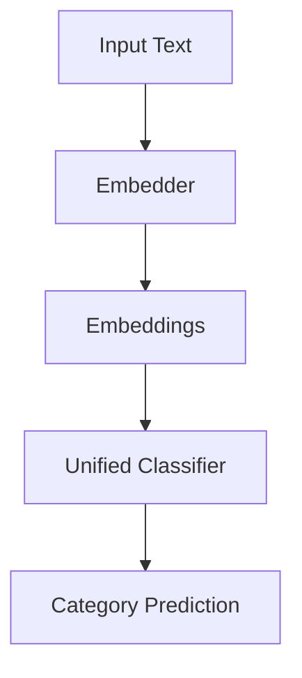

# Smart Article Categorizer

A sophisticated system that automatically classifies articles into different categories using multiple embedding approaches. This project demonstrates best practices for organizing machine learning code with a focus on modularity, extensibility, and clean architecture.

## Project Structure

```
project_root/
├── core/                   # Core components and business logic
│   ├── __init__.py        # Exposes core components
│   ├── embedders.py       # All embedding models in one place
│   ├── classifier.py      # Unified classifier interface
│   └── data_loader.py     # Data loading and preprocessing
│
├── pipelines/             # Training and evaluation pipelines
│   ├── __init__.py        # Exposes pipeline entry points
│   ├── train_and_evaluate.py  # Main training pipeline (OpenAI)
│   ├── train_bert.py      # BERT-specific pipeline
│   ├── train_sbert.py     # SentenceBERT-specific pipeline
│   └── train_word2vec.py  # Word2Vec-specific pipeline
│
├── models/                # Saved model artifacts
│   ├── openai_classifier.joblib
│   ├── bert_classifier.joblib
│   ├── sbert_classifier.joblib
│   └── word2vec_classifier.joblib
│
├── plots/                 # Visualization outputs
├── config.py             # Centralized configuration
├── requirements.txt      # Project dependencies
└── README.md            # Project documentation
```

## Architecture Design Principles

### 1. Core Components (`core/`)
- **Single Responsibility**: Each module has a clear, focused purpose
- **Interface Segregation**: Base classes define clean interfaces
- **Dependency Injection**: Components accept dependencies rather than creating them
- **Open/Closed**: Easy to add new embedders without modifying existing code

#### Key Files:
- `embedders.py`: All embedding models inherit from base `Embedder` class
- `classifier.py`: Unified classifier that works with any embedder
- `data_loader.py`: Standardized data loading across all pipelines

### 2. Training Pipelines (`pipelines/`)
- **Separation of Concerns**: Training logic separate from model definitions
- **Don't Repeat Yourself**: Common functionality shared via core components
- **Configuration Isolation**: All settings in `config.py`
- **Consistent Interface**: All pipelines follow same pattern

### 3. Configuration (`config.py`)
- **Single Source of Truth**: All configurable values in one place
- **Environment Awareness**: Handles different environments (dev/prod)
- **Path Management**: Centralizes file/directory path handling

## Implementation Guide

### 1. Adding a New Embedding Model

1. Create new embedder class in `core/embedders.py`:
```python
class NewEmbedder(Embedder):
    def __init__(self, **kwargs):
        # Initialize your model
        pass
        
    def get_embeddings(self, texts: List[str]) -> np.ndarray:
        # Implement embedding logic
        pass
```

2. Add to `core/__init__.py`:
```python
from .embedders import NewEmbedder
__all__ += ['NewEmbedder']
```

3. Create training pipeline in `pipelines/train_new.py`:
```python
from core.embedders import NewEmbedder
from core.classifier import UnifiedClassifier
# ... implement training pipeline
```

### 2. Data Flow


## Current Models

1. **OpenAI Embeddings** (`text-embedding-ada-002`)
   - High-quality embeddings
   - Requires API key
   - Best for production use

2. **BERT** (`bert-base-uncased`)
   - [CLS] token embeddings
   - Local computation
   - Good balance of quality/speed

3. **Sentence-BERT** (`all-MiniLM-L6-v2`)
   - Optimized for sentence embeddings
   - Fast inference
   - Good for semantic similarity

4. **Word2Vec/GloVe**
   - Lightweight
   - Average word vectors
   - Good baseline model

## Setup and Usage

1. Create virtual environment:
```bash
python -m venv venv
source venv/bin/activate  # On Windows: venv\Scripts\activate
```

2. Install dependencies:
```bash
pip install -r requirements.txt
```

3. Set up environment variables:
```bash
export OPENAI_API_KEY=your_api_key_here
```

4. Run training pipelines:
```bash
# Train with OpenAI embeddings
python -m pipelines.train_and_evaluate

# Train with BERT
python -m pipelines.train_bert

# Train with Sentence-BERT
python -m pipelines.train_sbert

# Train with Word2Vec
python -m pipelines.train_word2vec
```

## Best Practices for Similar Projects

1. **Start with Architecture**:
   - Define interfaces first
   - Plan for extensibility
   - Consider future maintenance

2. **Organize by Function**:
   - Group by responsibility, not technology
   - Keep related code together
   - Make dependencies explicit

3. **Configuration Management**:
   - Centralize configuration
   - Use environment variables
   - Make paths relative to project root

4. **Documentation**:
   - Document architecture decisions
   - Provide clear examples
   - Include setup instructions

5. **Testing** (TODO):
   - Unit tests for core components
   - Integration tests for pipelines
   - Test configuration management

## Future Improvements

1. Add web interface for real-time classification
2. Implement model ensembling
3. Add visualization of embedding clusters
4. Expand test coverage
5. Add model versioning and experiment tracking
6. Implement continuous evaluation pipeline

## Contributing

1. Fork the repository
2. Create a feature branch
3. Make your changes
4. Submit a pull request

## License

MIT License
